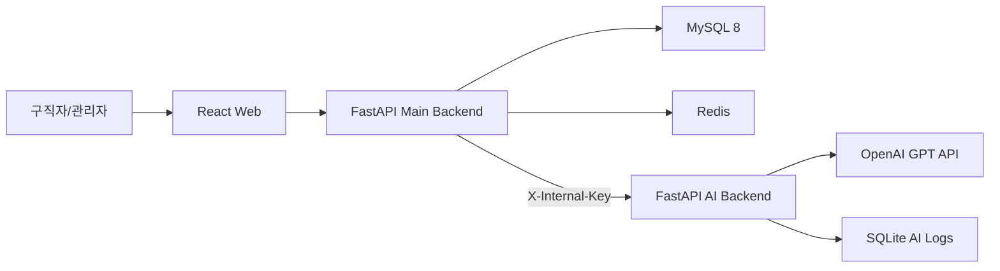
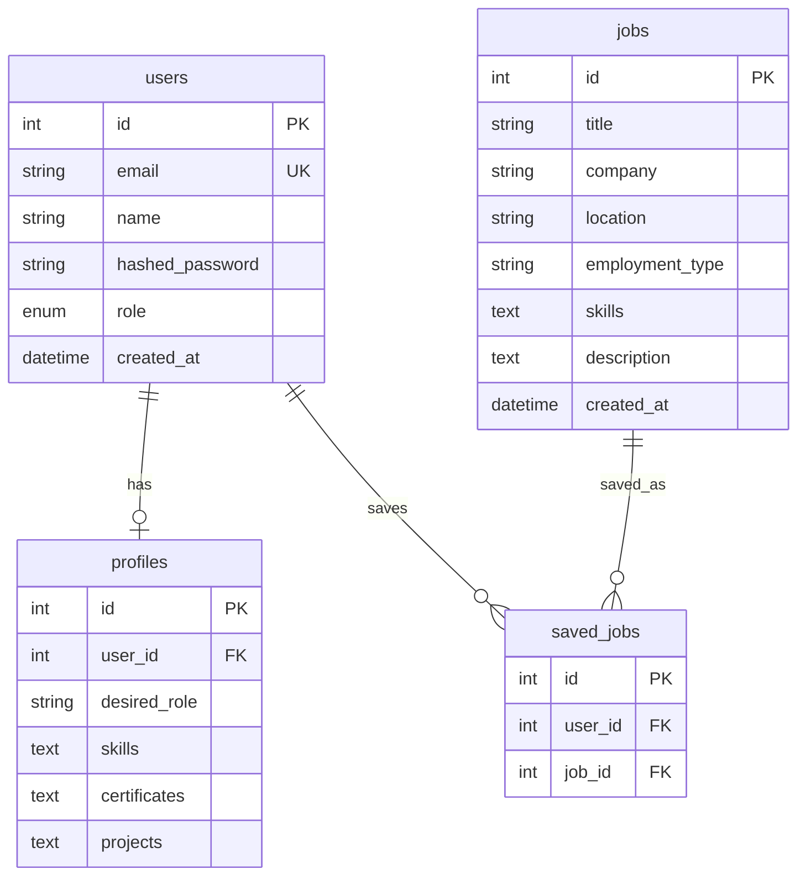

# CareerStep MSA Architecture

## 1. 구현 목표

CareerStep은 구직자 웹, 관리자 웹, 메인 FastAPI 백엔드, AI FastAPI 백엔드로 구성된 AI 취업 지원 플랫폼이다. MVP에서는 인증, 프로필, 채용공고, 관심공고, AI 추천 프록시를 우선 구현하고, AI 서비스는 Docker 내부 네트워크에서만 접근 가능하게 둔다.

## 2. 전체 흐름



통신 방향은 `프론트엔드 -> 메인 백엔드 -> AI 서비스`만 허용한다. 프론트엔드는 AI 서비스 URL과 API Key를 절대 알지 않는다.

## 3. 필요한 파일 구조

```text
CarrerStep/
  src/                         # React 구직자/관리자 웹 MVP
  services/
    main-backend/              # FastAPI 메인 백엔드
    ai-backend/                # FastAPI AI 서비스 백엔드
  docker-compose.yml
  .env.example
```

## 4. API 설계

메인 백엔드:

| Method | Path | 설명 |
| --- | --- | --- |
| POST | `/api/v1/auth/signup` | 회원가입 |
| POST | `/api/v1/auth/login` | 로그인 및 JWT 발급 |
| POST | `/api/v1/auth/logout` | Refresh Token 삭제 |
| GET | `/api/v1/profiles/me` | 내 취업 프로필 조회 |
| PUT | `/api/v1/profiles/me` | 내 취업 프로필 저장 |
| GET | `/api/v1/jobs` | 채용공고 목록 |
| POST | `/api/v1/jobs` | 관리자 채용공고 등록 |
| POST | `/api/v1/jobs/{job_id}/save` | 관심공고 저장 |
| POST | `/api/v1/ai/recommend/jobs` | AI 추천 프록시 |
| POST | `/api/v1/ai/essay/draft` | 자기소개서 초안 프록시 |

AI 백엔드:

| Method | Path | 설명 |
| --- | --- | --- |
| POST | `/api/v1/recommend/jobs` | 채용공고 추천 및 부족 역량 분석 |
| POST | `/api/v1/essay/draft` | 자기소개서 초안 생성 |

## 5. DB 구조



AI 서비스 SQLite는 `ai_logs` 테이블에 endpoint, request_json, response_json, violation_detected, created_at을 기록한다.

## 6. 프론트엔드 코드

프론트엔드는 React Router v6와 Zustand를 사용한다.

- `useUserStore`: 사용자 정보와 Access Token
- `useProfileStore`: 취업 프로필
- `useJobStore`: 채용공고와 관심공고
- `useRecommendStore`: AI 추천 결과와 부족 역량
- `src/api/client.ts`: Axios 인스턴스와 Bearer Token 인터셉터

## 7. 메인 백엔드 코드

메인 백엔드는 인증, 권한, MySQL CRUD, Redis Refresh Token 저장, AI 서비스 프록시를 담당한다. AI 호출은 `services/main-backend/app/services/ai_client.py`에서 `X-Internal-Key` 헤더를 붙여 내부 네트워크로만 요청한다.

## 8. AI 서비스 코드

AI 백엔드는 OpenAI SDK로 `gpt-4o-mini`를 호출하고 `response_format={"type": "json_object"}`로 JSON 응답을 강제한다. 사용자 입력은 JSON payload로 분리해 전달하며, 프롬프트는 허위 경력 생성을 금지한다.

## 9. 환경변수 목록

`.env.example`을 `.env`로 복사해 사용한다. 실제 키는 Git에 커밋하지 않는다.

## 10. 실행 방법

```bash
cp .env.example .env
docker compose up --build
```

프론트엔드 로컬 개발:

```bash
npm install
npm run dev
```

## 11. 에러 처리 및 예외 케이스

- Access Token이 없거나 만료되면 `401`을 반환한다.
- 관리자 API에 일반 사용자가 접근하면 `403`을 반환한다.
- AI 서비스 장애는 메인 백엔드에서 `502`로 변환한다.
- AI 응답이 Pydantic 출력 스키마와 맞지 않으면 AI 백엔드에서 검증 오류가 발생한다.
- 허위 경력 생성 또는 정책 위반 가능성이 있으면 `policy_violation=true`로 로깅한다.

## 12. 주의할 점

- 프론트엔드에서 `OPENAI_API_KEY`, `AI_SERVICE_URL`, `INTERNAL_SERVICE_KEY`를 사용하지 않는다.
- 운영 배포에서는 `ai-backend`에 host port를 열지 않는다. Compose도 `expose`만 사용한다.
- 팀 프로젝트 MVP에서는 Alembic 마이그레이션을 다음 단계로 추가하고, 초기에는 SQLAlchemy 모델 기준으로 테이블 생성을 자동화하거나 별도 init 스크립트를 둔다.
- 자기소개서와 면접 답변 생성은 사용자가 입력한 경험만 근거로 사용해야 한다.
