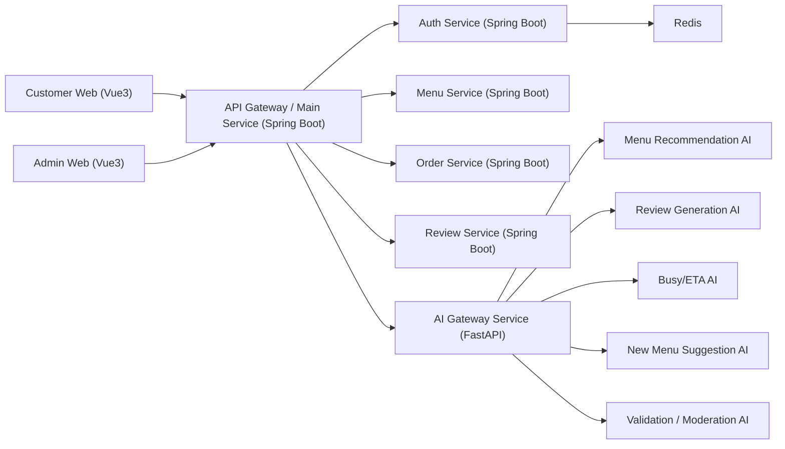

# Restaurant Platform MSA 설계

## 1. 목표

식당 주문/관리 플랫폼을 MSA 구조로 분리하여 다음 요구를 만족한다.

- 고객용 웹과 관리자용 웹을 분리한다.
- 정적 데이터 관리와 AI 기능을 별도 백엔드로 분리한다.
- 인증, 메뉴, 주문, 후기, AI 기능의 책임을 명확히 나눈다.
- 향후 서비스 확장과 Docker 기반 배포가 쉽도록 모노레포 구조를 사용한다.

## 2. 상위 아키텍처



## 3. 서비스 구성

### 3.1 프론트엔드

#### Customer Web
- 고객 주문용 웹
- 카테고리 기반 메뉴 조회
- 장바구니는 `localStorage` 저장
- 주문 생성
- 메뉴 추천, 후기 자동 작성, 혼잡도/예상시간 조회

#### Admin Web
- 식당 관리자용 웹
- 매출 정산 조회
- 메뉴 등록/수정/비활성화
- 주문 현황 조회
- 후기 관리
- AI 기반 신메뉴 추천 조회

### 3.2 메인 라우팅 계층

#### API Gateway / Main Service
- 프론트엔드의 단일 진입점
- 인증 토큰 전달/검증 위임
- 내부 서비스 라우팅
- 공통 응답 포맷, 로깅, 예외 처리
- 필요 시 rate limit, tracing, CORS 설정 담당

권장 이유:
- 프론트엔드가 여러 내부 서비스 주소를 직접 알 필요가 없다.
- 서비스 분리 이후에도 클라이언트 변경을 최소화할 수 있다.

### 3.3 Spring Boot 서비스

#### Auth Service
- 회원가입 / 로그인
- 일반 사용자 / 관리자 권한 분리
- JWT Access / Refresh Token 발급
- 만료 및 재발급 처리
- 로그아웃 및 토큰 무효화
- Redis 활용 대상:
  - Refresh Token 저장
  - 블랙리스트 토큰 관리
  - 로그인 세션 캐시

DB 주요 테이블:
- users
- user_roles
- refresh_tokens

#### Menu Service
- 메뉴 조회
- 카테고리별 조회
- 키워드별 조회
- 관리자 메뉴 등록/수정/삭제(소프트 삭제 권장)
- 메뉴 이미지/설명/가격/재고/노출 여부 관리

DB 주요 테이블:
- categories
- menu_items
- menu_keywords
- menu_item_keywords

#### Order Service
- 장바구니 기반 주문 생성
- 주문 상태 관리
- 관리자 주문 조회
- 예상 조리 시간 계산용 기초 데이터 제공

권장 주문 상태:
- `CREATED`
- `CONFIRMED`
- `COOKING`
- `READY`
- `COMPLETED`
- `CANCELLED`

DB 주요 테이블:
- orders
- order_items
- order_status_histories

#### Review Service
- 사용자 후기 저장/조회
- AI 자동 생성 후기 저장
- 서비스 품질 평가 점수 저장
- 관리자 후기 모니터링

DB 주요 테이블:
- reviews
- review_keywords
- review_ai_results

### 3.4 FastAPI AI 계층

#### AI Gateway Service
- AI 관련 API 단일 진입점
- 요청 validation
- 프롬프트 조립
- GPT API 호출
- 응답 후처리 및 저장 대상 서비스와 연계

#### Review Generation AI
- 키워드 기반 후기 자동 생성
- 별점은 `1~5` 정수
- 가급적 긍정적 평가 유도
- 생성 결과를 Review Service에 저장 요청

#### Menu Recommendation AI
- 사용자 키워드/채팅 기반 메뉴 추천
- 가게 내 실제 판매 메뉴 기준으로만 추천
- 추천 사유를 함께 반환

#### Busy / ETA AI
- 현재 주문량, 시간대, 메뉴별 평균 준비시간 기준
- 현재 혼잡도 판단
- 메뉴 예상 소요 시간 예측

#### New Menu Suggestion AI
- 주문 이력 / 인기 메뉴 / 키워드 트렌드 기반
- 관리자 대상 신메뉴 아이디어 제안

#### Validation / Moderation AI
- 사용자 입력이 유효한지 판단
- 비정상 입력, 욕설, 스팸, 정책 위반 여부 판단
- GPT 생성 결과의 적절성 검사

## 4. 서비스 간 책임 분리

### Spring Boot 계층이 담당하는 것
- 사용자/권한 관리
- 메뉴/주문/후기 정적 데이터 저장
- 트랜잭션 처리
- 관리자 기능
- AI 결과 저장

### FastAPI 계층이 담당하는 것
- 프롬프트 생성
- GPT API 호출
- AI 판단 및 추천 로직
- validation / moderation

### Redis 역할
- Refresh Token 저장
- 인증 관련 캐시
- 혼잡도/추천 결과 단기 캐시
- 자주 조회되는 메뉴/카테고리 캐시

## 5. 서비스 간 호출 흐름

### 5.1 고객 주문 흐름
1. 고객 웹이 메뉴 목록을 Gateway로 요청한다.
2. Gateway가 Menu Service로 전달한다.
3. 사용자가 장바구니를 `localStorage`에 저장한다.
4. 주문 버튼 클릭 시 Customer Web이 주문 데이터를 Gateway로 전송한다.
5. Gateway가 Order Service에 주문 생성을 요청한다.
6. 관리자는 Admin Web에서 주문 내역을 조회한다.

### 5.2 후기 자동 작성 흐름
1. 고객이 키워드를 선택한다.
2. Customer Web이 Gateway를 통해 AI Gateway Service를 호출한다.
3. AI Gateway가 Validation / Moderation을 먼저 수행한다.
4. Review Generation AI가 GPT로 후기 초안을 생성한다.
5. 결과를 Review Service에 저장한다.
6. 최종 후기를 고객에게 반환한다.

### 5.3 메뉴 추천 흐름
1. 고객이 키워드 또는 채팅을 입력한다.
2. AI Gateway Service가 입력 유효성 검사 수행
3. Menu Recommendation AI가 가게 메뉴 목록을 참조해 추천 생성
4. 추천 결과를 반환하고 필요 시 Redis에 캐시한다.

### 5.4 혼잡도 / 예상시간 흐름
1. 고객이 현재 이용시간 정보를 요청한다.
2. Gateway가 AI Gateway Service를 호출한다.
3. AI Gateway가 Order Service의 최근 주문량 데이터와 Menu Service의 메뉴 메타데이터를 참고한다.
4. Busy / ETA AI가 혼잡도와 예상시간을 계산한다.
5. 결과를 고객 웹에 반환한다.

## 6. 데이터 저장 전략

현재 요구 기준으로는 각 서비스가 독립 DB를 갖는 구조를 권장한다.

- `auth-db (sqlite)`
- `menu-db (sqlite)`
- `order-db (sqlite)`
- `review-db (sqlite)`
- `ai-db (sqlite)` 또는 AI 로그/캐시 목적 최소 저장소

주의:
- SQLite는 개발/초기 PoC에는 적합하지만, 동시성 높은 운영 환경에서는 한계가 있다.
- 실제 운영 확장 시 `PostgreSQL` 전환을 염두에 두고 Repository 계층을 분리하는 것이 좋다.

## 7. 인증 / 권한 설계

권장 권한:
- `ROLE_CUSTOMER`
- `ROLE_ADMIN`

인증 방식:
- 로그인 성공 시 Access Token, Refresh Token 발급
- Access Token은 API 호출에 사용
- Refresh Token은 재발급에 사용
- 관리자 API는 `ROLE_ADMIN`만 접근 가능

권한 분리가 필요한 주요 기능:
- 메뉴 등록/수정/삭제
- 주문 전체 조회
- 매출 정산 조회
- 신메뉴 추천 결과 조회

## 8. 추천 폴더 구조

```text
restaurant/
├─ docs/
│  └─ msa-architecture.md
├─ infra/
│  ├─ docker/
│  │  ├─ nginx/
│  │  ├─ spring/
│  │  └─ fastapi/
│  ├─ compose/
│  │  ├─ docker-compose.local.yml
│  │  └─ docker-compose.prod.yml
│  └─ scripts/
├─ frontend/
│  ├─ customer-web/
│  │  ├─ public/
│  │  ├─ src/
│  │  │  ├─ assets/
│  │  │  ├─ components/
│  │  │  ├─ layouts/
│  │  │  ├─ pages/
│  │  │  ├─ router/
│  │  │  ├─ stores/
│  │  │  ├─ services/
│  │  │  ├─ composables/
│  │  │  ├─ types/
│  │  │  └─ utils/
│  │  ├─ .env.example
│  │  ├─ package.json
│  │  └─ vite.config.ts
│  └─ admin-web/
│     ├─ public/
│     ├─ src/
│     │  ├─ assets/
│     │  ├─ components/
│     │  ├─ layouts/
│     │  ├─ pages/
│     │  ├─ router/
│     │  ├─ stores/
│     │  ├─ services/
│     │  ├─ composables/
│     │  ├─ types/
│     │  └─ utils/
│     ├─ .env.example
│     ├─ package.json
│     └─ vite.config.ts
├─ backend/
│  ├─ gateway-service/
│  │  ├─ src/main/java/com/restaurant/gateway/
│  │  │  ├─ config/
│  │  │  ├─ controller/
│  │  │  ├─ filter/
│  │  │  ├─ client/
│  │  │  └─ common/
│  │  ├─ src/main/resources/
│  │  ├─ build.gradle
│  │  └─ Dockerfile
│  ├─ auth-service/
│  │  ├─ src/main/java/com/restaurant/auth/
│  │  │  ├─ config/
│  │  │  ├─ controller/
│  │  │  ├─ service/
│  │  │  ├─ domain/
│  │  │  ├─ repository/
│  │  │  ├─ security/
│  │  │  └─ dto/
│  │  ├─ src/main/resources/
│  │  ├─ build.gradle
│  │  └─ Dockerfile
│  ├─ menu-service/
│  │  ├─ src/main/java/com/restaurant/menu/
│  │  │  ├─ controller/
│  │  │  ├─ service/
│  │  │  ├─ domain/
│  │  │  ├─ repository/
│  │  │  └─ dto/
│  │  ├─ src/main/resources/
│  │  ├─ build.gradle
│  │  └─ Dockerfile
│  ├─ order-service/
│  │  ├─ src/main/java/com/restaurant/order/
│  │  │  ├─ controller/
│  │  │  ├─ service/
│  │  │  ├─ domain/
│  │  │  ├─ repository/
│  │  │  └─ dto/
│  │  ├─ src/main/resources/
│  │  ├─ build.gradle
│  │  └─ Dockerfile
│  └─ review-service/
│     ├─ src/main/java/com/restaurant/review/
│     │  ├─ controller/
│     │  ├─ service/
│     │  ├─ domain/
│     │  ├─ repository/
│     │  └─ dto/
│     ├─ src/main/resources/
│     ├─ build.gradle
│     └─ Dockerfile
├─ ai-backend/
│  ├─ ai-gateway/
│  │  ├─ app/
│  │  │  ├─ api/
│  │  │  ├─ core/
│  │  │  ├─ clients/
│  │  │  ├─ services/
│  │  │  ├─ prompts/
│  │  │  ├─ schemas/
│  │  │  └─ utils/
│  │  ├─ tests/
│  │  ├─ .env.example
│  │  ├─ requirements.txt
│  │  └─ Dockerfile
│  ├─ review-ai/
│  │  ├─ app/
│  │  │  ├─ api/
│  │  │  ├─ services/
│  │  │  ├─ prompts/
│  │  │  └─ schemas/
│  │  ├─ tests/
│  │  ├─ requirements.txt
│  │  └─ Dockerfile
│  ├─ recommendation-ai/
│  │  ├─ app/
│  │  │  ├─ api/
│  │  │  ├─ services/
│  │  │  ├─ prompts/
│  │  │  └─ schemas/
│  │  ├─ tests/
│  │  ├─ requirements.txt
│  │  └─ Dockerfile
│  ├─ eta-ai/
│  │  ├─ app/
│  │  │  ├─ api/
│  │  │  ├─ services/
│  │  │  ├─ prompts/
│  │  │  └─ schemas/
│  │  ├─ tests/
│  │  ├─ requirements.txt
│  │  └─ Dockerfile
│  ├─ new-menu-ai/
│  │  ├─ app/
│  │  │  ├─ api/
│  │  │  ├─ services/
│  │  │  ├─ prompts/
│  │  │  └─ schemas/
│  │  ├─ tests/
│  │  ├─ requirements.txt
│  │  └─ Dockerfile
│  └─ moderation-ai/
│     ├─ app/
│     │  ├─ api/
│     │  ├─ services/
│     │  ├─ prompts/
│     │  └─ schemas/
│     ├─ tests/
│     ├─ requirements.txt
│     └─ Dockerfile
├─ shared/
│  ├─ contracts/
│  │  ├─ openapi/
│  │  └─ events/
│  ├─ docs/
│  └─ examples/
├─ .env.example
└─ README.md
```

## 9. 구현 우선순위 제안

### 1차 MVP
- Customer Web
- Admin Web
- Gateway Service
- Auth Service
- Menu Service
- Order Service
- Review Service
- AI Gateway
- Review Generation AI
- Menu Recommendation AI

### 2차 확장
- Busy / ETA AI
- New Menu Suggestion AI
- Validation / Moderation AI
- Redis 캐싱 고도화
- 매출 정산 상세 기능

## 10. 권장 개발 원칙

- 서비스별 `.env.example` 제공
- API 계약은 OpenAPI로 문서화
- 각 서비스는 독립 실행 가능해야 함
- DB 접근 계층과 비즈니스 계층 분리
- AI 프롬프트는 `prompts/` 폴더에서 버전 관리
- 관리자 기능과 고객 기능의 API 권한을 엄격히 분리

## 11. 추가 권장 사항

- 초기에 완전한 마이크로서비스보다 "느슨한 모듈 분리 + 독립 배포 가능 구조"로 시작하는 것이 현실적이다.
- SQLite를 유지하더라도 서비스별 DB 파일은 반드시 분리하는 것이 좋다.
- AI 결과는 반드시 moderation 또는 validation 단계를 거친 뒤 저장하는 흐름을 권장한다.
- 신메뉴 추천과 혼잡도 예측은 초기에는 규칙 기반 + GPT 보조 형태로 시작하고, 이후 데이터가 쌓이면 고도화하는 편이 안정적이다.
