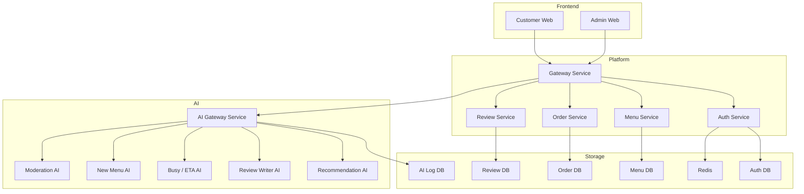
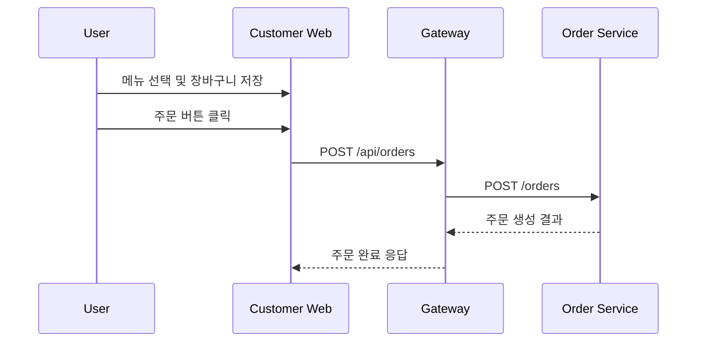
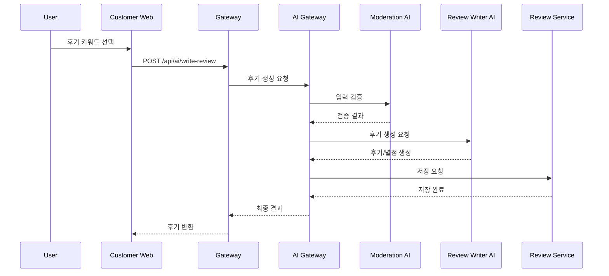
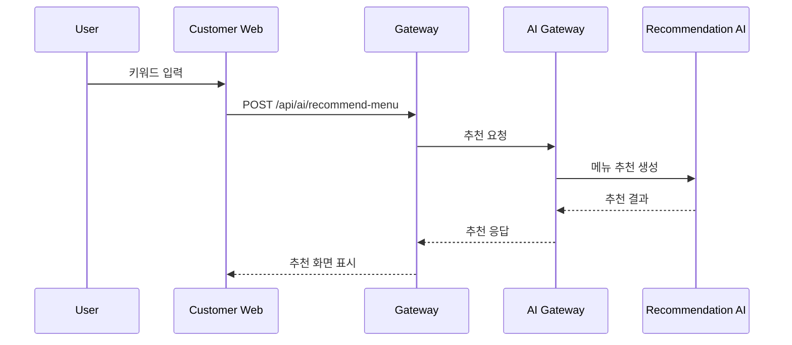

# Restaurant Platform 서비스 아키텍처

## 1. 문서 목적

이 문서는 식당 플랫폼의 서비스 아키텍처를 구체화하기 위한 설계 문서이다.

주요 목적은 다음과 같다.

- 서비스별 책임과 경계를 명확히 정의
- 서비스 간 통신 구조 정리
- 각 서비스 내부 레이어 구조 정의
- 데이터 저장 위치와 캐시 활용 범위 정리
- 실제 구현 시 공통 규칙 제안

## 2. 전체 서비스 아키텍처



## 3. 서비스 분해 원칙

서비스는 다음 원칙에 따라 분리한다.

- 인증은 독립 서비스로 분리한다.
- 메뉴, 주문, 후기는 각각 별도 비즈니스 서비스로 둔다.
- AI 관련 기능은 Spring 계층과 분리하여 FastAPI 계층에서 담당한다.
- 프론트엔드는 내부 서비스 구조를 직접 알지 않고 Gateway만 호출한다.
- 서비스별 데이터 저장소는 분리한다.
- 초기 구현은 동기 HTTP 통신 중심으로 시작하고, 필요 시 이벤트 기반 확장 가능하게 설계한다.

## 4. 서비스 목록 및 책임

## 4.1 Gateway Service

역할:
- 프론트엔드의 단일 진입점
- 내부 서비스 라우팅
- 공통 인증 정보 전달
- 공통 에러 응답 처리
- 요청 로깅 및 추적 ID 생성
- CORS 정책 적용

포함 기능:
- `/api/auth/**` 라우팅
- `/api/menus/**` 라우팅
- `/api/orders/**` 라우팅
- `/api/reviews/**` 라우팅
- `/api/ai/**` 라우팅

제외 기능:
- 사용자 정보 직접 저장
- 주문 비즈니스 처리
- GPT 호출

내부 레이어 권장 구조:
- `config/`
- `filter/`
- `controller/` 또는 `route/`
- `client/`
- `common/exception/`

## 4.2 Auth Service

역할:
- 회원가입
- 로그인
- 사용자 권한 관리
- JWT 발급/검증
- Refresh Token 관리
- 로그아웃 처리

주요 도메인:
- User
- Role
- RefreshToken

주요 API 예시:
- `POST /auth/signup`
- `POST /auth/login`
- `POST /auth/refresh`
- `POST /auth/logout`
- `GET /auth/me`

저장소:
- `auth.db`
- Redis

Redis 사용 예:
- Refresh Token 캐시
- 로그아웃된 토큰 블랙리스트
- 짧은 TTL의 세션성 데이터

## 4.3 Menu Service

역할:
- 메뉴 등록/수정/조회
- 카테고리 관리
- 키워드 관리
- 메뉴 노출 여부 관리
- 관리자용 메뉴 관리 기능 제공

주요 도메인:
- Category
- MenuItem
- MenuKeyword

주요 API 예시:
- `GET /menus`
- `GET /menus/{menuId}`
- `GET /menus/categories`
- `POST /admin/menus`
- `PUT /admin/menus/{menuId}`
- `DELETE /admin/menus/{menuId}`

저장소:
- `menu.db`

캐시 대상:
- 카테고리 목록
- 인기 메뉴 목록
- 자주 조회되는 메뉴 상세

## 4.4 Order Service

역할:
- 주문 생성
- 주문 상태 관리
- 주문 내역 조회
- 관리자 주문 확인
- 혼잡도 분석용 기본 주문 집계 데이터 제공

주요 도메인:
- Order
- OrderItem
- OrderStatusHistory

주요 API 예시:
- `POST /orders`
- `GET /orders/my`
- `GET /orders/{orderId}`
- `GET /admin/orders`
- `PATCH /admin/orders/{orderId}/status`
- `GET /orders/statistics/current`

저장소:
- `order.db`

비고:
- 장바구니는 프론트 `localStorage`에 있고, 서버에는 주문 시점 데이터만 전달된다.

## 4.5 Review Service

역할:
- 사용자 후기 저장
- AI 생성 후기 저장
- 후기 조회
- 품질 평가 결과 저장
- 관리자 후기 관리

주요 도메인:
- Review
- ReviewKeyword
- ReviewAiResult

주요 API 예시:
- `GET /reviews`
- `POST /reviews`
- `POST /reviews/ai-generated`
- `GET /admin/reviews`

저장소:
- `review.db`

## 4.6 AI Gateway Service

역할:
- AI 요청 통합 진입점
- 입력 validation
- 프롬프트 조립
- GPT API 호출 조정
- AI 결과 후처리
- 결과 저장을 위한 Spring 서비스 연계

주요 API 예시:
- `POST /ai/recommend-menu`
- `POST /ai/write-review`
- `GET /ai/busy-status`
- `POST /ai/new-menu-suggestion`
- `POST /ai/validate-input`

저장소:
- `ai.db` 또는 AI 요청/응답 로그 저장소

내부 구성:
- `api/`
- `services/`
- `prompts/`
- `clients/`
- `schemas/`
- `core/`

## 4.7 Recommendation AI

역할:
- 키워드 또는 사용자 채팅 기반 메뉴 추천
- 추천 메뉴와 추천 이유 반환

입력:
- 사용자 키워드
- 자유 입력 문장
- 메뉴 목록

출력:
- 추천 메뉴 목록
- 추천 이유
- 관련 키워드

## 4.8 Review Writer AI

역할:
- 키워드 기반 후기 자동 생성
- 별점과 후기 문장 생성

입력:
- 선택 키워드
- 메뉴명
- 매장 정보

출력:
- 후기 본문
- 별점
- 톤 정보

정책:
- 별점은 1~5 정수
- 과도하게 부정적 표현은 제한

## 4.9 Busy / ETA AI

역할:
- 현재 매장 혼잡도 계산
- 특정 메뉴의 예상 준비 시간 계산

입력:
- 최근 주문 수
- 시간대
- 메뉴별 평균 조리시간
- 현재 처리 중 주문 수

출력:
- 혼잡도 상태
- 예상 대기시간
- 메뉴별 ETA

## 4.10 New Menu AI

역할:
- 관리자 대상 신메뉴 아이디어 추천
- 주문 이력과 키워드 기반 트렌드 분석

입력:
- 주문 통계
- 인기 메뉴
- 키워드 추이
- 사용자 선호 경향

출력:
- 신메뉴 후보
- 추천 이유
- 타겟 고객층

## 4.11 Moderation AI

역할:
- 사용자 입력 검증
- GPT 출력 검증
- 정책 위반 여부 판단

입력:
- 사용자 채팅
- AI 생성 결과

출력:
- 허용 여부
- 위반 사유
- 정제된 입력 또는 차단 결과

## 5. 서비스 간 통신 방식

초기 단계에서는 REST 기반 동기 통신을 권장한다.

기본 원칙:
- 프론트엔드는 Gateway만 호출한다.
- Gateway는 내부 Spring 서비스 및 AI Gateway를 호출한다.
- AI Gateway는 필요 시 Spring 서비스 데이터를 조회한다.
- 직접 DB 공유 대신 API 호출을 우선한다.

권장 통신 방식:
- 프론트엔드 ↔ Gateway: HTTP/JSON
- Gateway ↔ Spring Services: HTTP/JSON
- Gateway ↔ AI Gateway: HTTP/JSON
- AI Gateway ↔ GPT API: HTTPS
- 서비스 내부 비동기화가 필요해지면 추후 메시지 브로커 도입 검토

## 6. 내부 레이어 아키텍처

각 서비스는 가급적 공통 레이어 구조를 유지한다.

### 6.1 Spring Boot 서비스 레이어

```text
controller
  -> service
     -> repository
        -> database
```

권장 패키지:
- `controller`
- `service`
- `domain`
- `repository`
- `dto`
- `config`
- `exception`

설명:
- `controller`: 요청/응답 처리
- `service`: 비즈니스 로직
- `repository`: DB 접근
- `domain`: 엔티티/모델
- `dto`: API 입출력 스키마

### 6.2 FastAPI 서비스 레이어

```text
api
  -> services
     -> clients / prompts / schemas
```

권장 패키지:
- `api`
- `services`
- `clients`
- `prompts`
- `schemas`
- `core`
- `utils`

설명:
- `api`: 라우터
- `services`: AI 기능 로직
- `clients`: 외부 API 및 내부 서비스 호출
- `prompts`: 프롬프트 템플릿
- `schemas`: Pydantic 모델

## 7. 데이터 아키텍처

## 7.1 DB 분리

서비스별 DB 분리를 권장한다.

- Auth Service → `auth.db`
- Menu Service → `menu.db`
- Order Service → `order.db`
- Review Service → `review.db`
- AI Gateway → `ai.db`

장점:
- 서비스 책임이 명확하다.
- 마이그레이션 충돌이 줄어든다.
- 추후 SQLite에서 PostgreSQL로 이전하기 쉽다.

## 7.2 캐시 전략

Redis 권장 사용처:
- Access/Refresh Token 관련 캐시
- 자주 조회되는 메뉴 목록
- 일시적인 추천 결과 캐시
- 혼잡도 계산 결과 캐시

TTL 예시:
- 메뉴 캐시: 5~30분
- 추천 결과: 1~10분
- 혼잡도 상태: 30초~2분

## 8. 인증 및 보안 아키텍처

인증 흐름:
1. 사용자가 로그인 요청
2. Auth Service가 사용자 검증
3. Access Token / Refresh Token 발급
4. 프론트는 Access Token으로 API 호출
5. Gateway 또는 각 서비스가 토큰 검증
6. 만료 시 Refresh Token으로 재발급

권장 사항:
- 관리자 API는 반드시 역할 검사 적용
- AI 입력도 인증 사용자 기준으로 추적 가능해야 함
- GPT 호출 전 moderation 단계 적용 가능하도록 설계
- API 키는 모두 `.env` 관리

## 9. 대표 요청 시퀀스

## 9.1 고객 주문



## 9.2 후기 자동 작성



## 9.3 메뉴 추천



## 10. 배포 아키텍처 제안

Docker 기준 권장 배포 단위:
- `customer-web`
- `admin-web`
- `gateway-service`
- `auth-service`
- `menu-service`
- `order-service`
- `review-service`
- `ai-gateway`
- `redis`

초기에는 다음 두 가지 방식 중 하나를 권장한다.

### 방식 A. AI 세부 기능을 ai-gateway 내부 모듈로 통합
- 운영 복잡도가 낮다.
- 초기 MVP에 적합하다.
- 서비스 수가 적어 배포가 쉽다.

### 방식 B. AI 세부 기능을 개별 컨테이너로 분리
- 기능별 확장성이 높다.
- 장애 격리에 유리하다.
- 운영 복잡도가 증가한다.

현재 요구 기준에서는 `초기 MVP는 방식 A`, 이후 트래픽 증가 시 방식 B로 확장하는 것을 권장한다.

## 11. 추천 구현 순서

1. Gateway Service
2. Auth Service
3. Menu Service
4. Order Service
5. Review Service
6. Customer Web
7. Admin Web
8. AI Gateway
9. Recommendation AI
10. Review Writer AI
11. Busy / ETA AI
12. New Menu AI
13. Moderation AI

## 12. 설계 결론

이 프로젝트의 서비스 아키텍처는 다음 구조를 권장한다.

- 프론트는 고객용/관리자용으로 분리
- 서버 진입점은 Gateway 단일화
- 정적 비즈니스 데이터는 Spring Boot 서비스로 분리
- AI 기능은 FastAPI 계층으로 분리
- 데이터 저장소는 서비스별 DB 분리
- 인증과 캐시는 Redis를 활용
- 초기에는 단순한 동기 호출 중심으로 구현하고 이후 확장

가장 현실적인 시작점은 다음과 같다.

- Spring Boot 4개 서비스: Auth, Menu, Order, Review
- FastAPI 1개 통합 AI Gateway
- Vue 2개 앱: Customer Web, Admin Web
- Redis 1개
- SQLite 서비스별 분리
